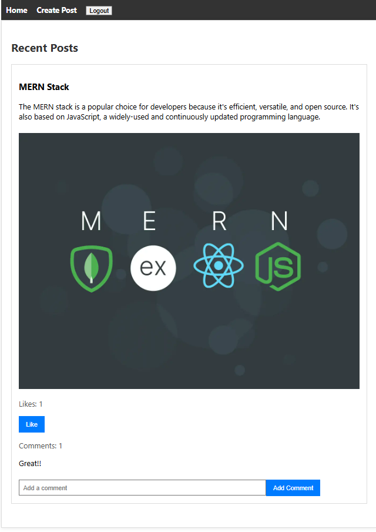

# AI-Powered Content Moderation System
Welcome to the **AI-Powered Content Moderation System**! 🎉 This project aims to create a content moderation platform that uses AI to automatically detect and flag inappropriate or harmful content (images, text, videos) on social media or forums. The AI model continuously learns to improve its accuracy.

## 🚀 Features

- **Automated Content Moderation**: Detects and flags inappropriate or harmful text content. (⚠️Working on image/video)
- **Continuous Learning**: The AI model improves its accuracy over time.
- **User and Content Management**: MongoDB is used to manage user and content data.
- **User Interface**: Built with React for a seamless user experience.

## 🛠️ Tech Stack

- **Frontend**: React
- **Backend**: Node.js, Express
- **Database**: MongoDB
- **AI/ML**: Gemini, LLM
- **Hosting**: Render

## 📸 Screenshots




## 🛠️ Installation

To run this project on your local machine, follow these steps:

1. **Clone the repository**:
    ```bash
    git clone https://github.com/yourusername/ai-content-moderation.git
    cd ai-content-moderation
    ```

2. **Install dependencies**:
    ```bash
    npm install
    cd social_frontend
    npm install
    cd ../social_backend
    npm install
    cd ..
    ```

3. **Set up environment variables**:
    Create a `.env` file in the root directory and add the following:
    ```bash
    MONGO_URI=mongodb://localhost:27017/yourdbname
    PORT=5000
    ```

4. **Run the application**:
    ```bash
    npm run dev
    ```

    This will start both the backend server and the React frontend.

## 📖 Usage

1. **Register/Login**: Create an account or log in to access the platform.
2. **Upload Content**: Upload text content to be moderated.
3. **View Results**: See the moderation results and flagged content.

## 🤝 Contributing

We welcome contributions! Please fork the repository and create a pull request with your changes.

## 📜 License

This project is licensed under the MIT License.

## 📬 Contact

For any questions or feedback, please open an issue.

Enjoy moderating content with AI! 🎉
